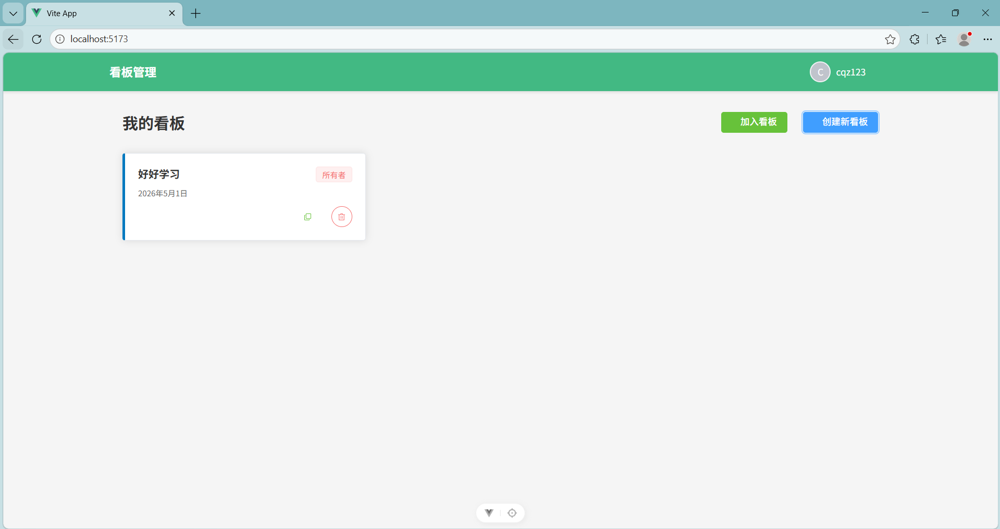
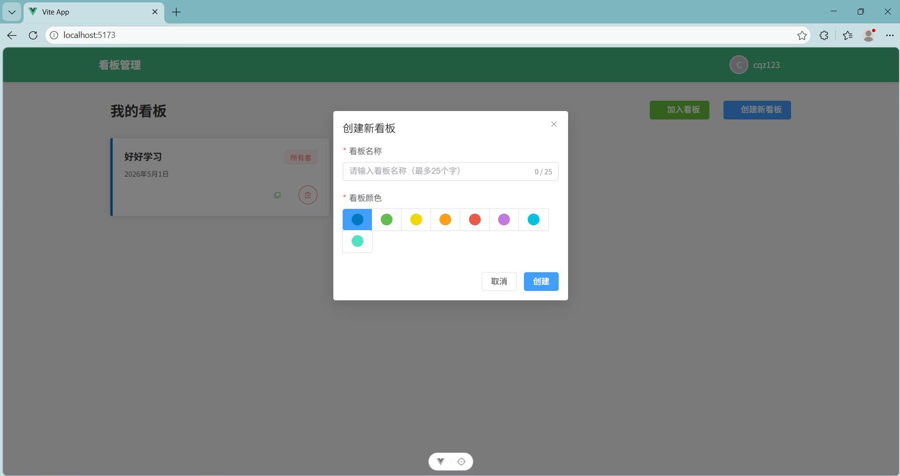
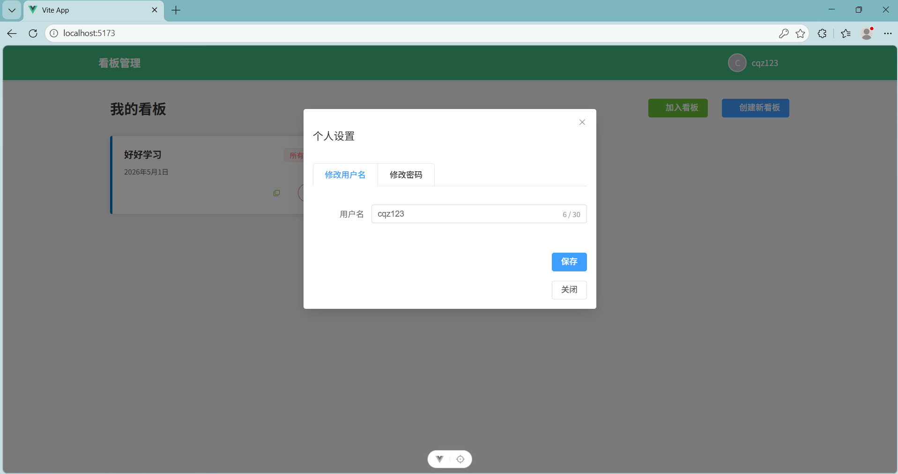
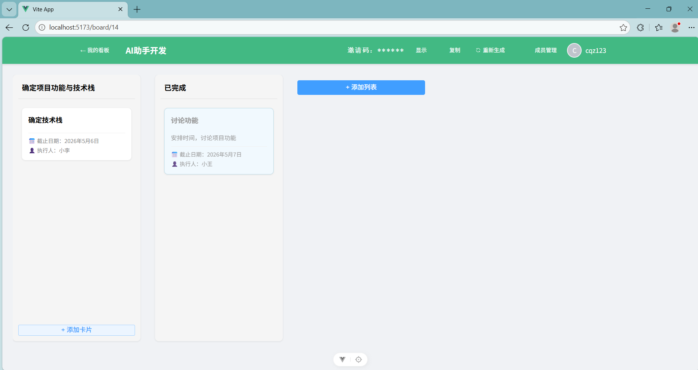
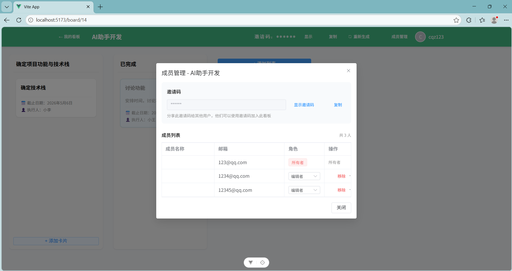

# Task Manager - 任务管理协作工具

一款基于 Web 的任务管理协作工具，支持多人协同管理任务，具备角色权限控制、实时同步等特性。

## 主要特性

- **看板管理** - 创建、编辑、删除看板，自定义颜色标识
- **列表与卡片** - 添加任务列表和卡片，支持拖拽排序
- **成员协作** - 通过邀请码加入看板，支持三种角色权限（所有者/编辑者/查看者）
- **权限控制** - 基于角色的访问控制，不同角色有不同的操作权限
- **实时同步** - 使用 Socket.IO 实现实时数据同步
- **个人设置** - 支持修改用户名和密码

## 功能预览

### 看板管理



### 创建看板



### 个人设置



### 看板详情



### 成员管理



## 技术栈

| 分类 | 技术 | 版本 |
|------|------|------|
| 后端框架 | Node.js | 20.x |
| Web 框架 | Express.js | 4.x |
| 语言 | TypeScript | 5.x |
| 数据库 | MySQL | 8.x |
| ORM | mysql2 | 3.x |
| 认证 | JWT | 9.x |
| 前端框架 | Vue.js | 3.x |
| 状态管理 | Pinia | 2.x |
| UI 组件 | Element Plus | 2.x |
| 路由 | Vue Router | 4.x |
| 构建工具 | Vite | 6.x |

## 环境要求

- Node.js >= 20.0.0
- MySQL >= 8.0
- npm >= 10.0.0

## 安装步骤

### 后端安装

```bash
cd backend
npm install
```

### 前端安装

```bash
cd frontend
npm install
```

## 配置说明

### 后端配置

在 `backend` 目录下创建 `.env` 文件：

```env
PORT=3000
DB_HOST=localhost
DB_USER=root
DB_PASSWORD=your_password
DB_NAME=task_manager
JWT_SECRET=your_jwt_secret_key
JWT_EXPIRES_IN=7d
```

### 数据库初始化

确保 MySQL 服务已启动，创建数据库：

```sql
CREATE DATABASE task_manager;
```

## 运行方式

### 启动后端服务

```bash
cd backend
npm run dev
```

后端服务将运行在 `http://localhost:3000`

### 启动前端开发服务器

```bash
cd frontend
npm run dev
```

前端服务将运行在 `http://localhost:5174`

### 生产构建

```bash
# 构建前端
cd frontend
npm run build

# 启动后端生产环境
cd backend
npm start
```

## 项目结构

```
task-manager/
├── backend/                    # 后端代码
│   ├── src/
│   │   ├── config/            # 配置文件
│   │   ├── controllers/       # 控制器
│   │   ├── middleware/        # 中间件
│   │   ├── routes/            # 路由
│   │   ├── services/          # 服务层
│   │   ├── types/             # TypeScript 类型定义
│   │   ├── utils/             # 工具函数
│   │   └── index.ts           # 应用入口
│   └── package.json
├── frontend/                   # 前端代码
│   ├── src/
│   │   ├── api/               # API 封装
│   │   ├── components/        # 组件
│   │   ├── layouts/           # 布局组件
│   │   ├── router/            # 路由配置
│   │   ├── stores/            # Pinia 状态管理
│   │   ├── types/             # 类型定义
│   │   ├── views/             # 页面视图
│   │   └── main.ts            # 应用入口
│   └── package.json
└── README.md
```

## API 接口

### 认证接口

| 方法 | 路径 | 描述 |
|------|------|------|
| POST | /api/auth/register | 用户注册 |
| POST | /api/auth/login | 用户登录 |

### 看板接口

| 方法 | 路径 | 描述 |
|------|------|------|
| GET | /api/boards | 获取看板列表 |
| POST | /api/boards | 创建看板 |
| GET | /api/boards/:boardId | 获取看板详情 |
| PUT | /api/boards/:boardId | 更新看板 |
| DELETE | /api/boards/:boardId | 删除看板 |
| POST | /api/boards/join-by-code | 通过邀请码加入看板 |

### 成员管理

| 方法 | 路径 | 描述 |
|------|------|------|
| GET | /api/boards/:boardId/members | 获取成员列表 |
| PATCH | /api/boards/:boardId/members/:userId | 修改成员角色 |
| DELETE | /api/boards/:boardId/members/:userId | 移除成员 |

### 列表接口

| 方法 | 路径 | 描述 |
|------|------|------|
| GET | /api/boards/:boardId/lists | 获取看板列表 |
| POST | /api/boards/:boardId/lists | 创建列表 |
| PUT | /api/boards/:boardId/lists/:listId | 更新列表 |
| DELETE | /api/boards/:boardId/lists/:listId | 删除列表 |
| PUT | /api/boards/:boardId/lists/reorder | 重新排序列表 |

### 卡片接口

| 方法 | 路径 | 描述 |
|------|------|------|
| GET | /api/boards/:boardId/lists/:listId/cards | 获取列表卡片 |
| POST | /api/boards/:boardId/lists/:listId/cards | 创建卡片 |
| PUT | /api/boards/:boardId/cards/:cardId | 更新卡片 |
| DELETE | /api/boards/:boardId/cards/:cardId | 删除卡片 |
| PUT | /api/boards/:boardId/cards/reorder | 拖拽移动卡片 |

## 角色权限说明

| 角色 | 权限 |
|------|------|
| 所有者 (owner) | 管理成员、修改看板、删除看板、重新生成邀请码 |
| 编辑者 (editor) | 添加/编辑/删除列表和卡片，拖拽排序 |
| 查看者 (viewer) | 仅查看，不可编辑，卡片只读 |

## 反馈与建议

请通过 [GitHub Issues](https://github.com/yourusername/task-manager/issues) 提交问题。